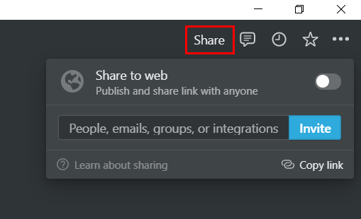
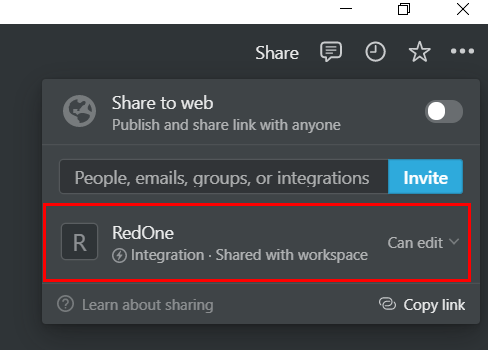
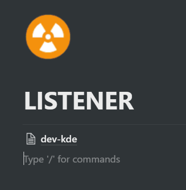
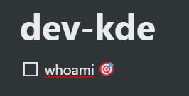
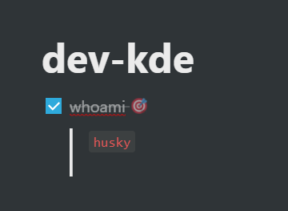
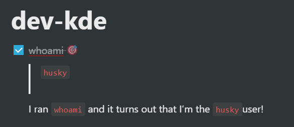
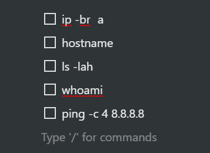
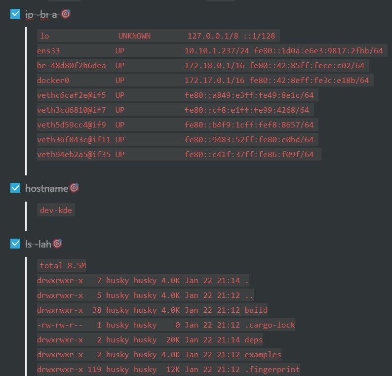

# OffensiveNotion
Notion (yes, the notetaking app) as a C2.

## Wait, What?
Yes.

## But Why?
What started as a meme grew into a full project. Just roll with it.

### Setup
To use Notion as a platform for offensive operations, you need a few things:

- A Notion account, available [here](https://www.notion.so/signup)
- A Notion Developers API account, available [here](https://developers.notion.com/)
- (if installing from source) 🦀 **Rust** 🦀. Head to [rustup](https://rustup.rs/) and run:
```
$ curl --proto '=https' --tlsv1.2 -sSf https://sh.rustup.rs | sh
```

### Setting Up A Listener Page
The "listener" is just a page in a Notion notebook. But you can set it up to catch the callbacks for your agents:

1) Create your listener page. Add a new page to Notion, preferably in a notebook that's not being used for anything else:


2) In the upper right corner, click "Share" and "Invite". Add your Notion Developer API account to this page:





3) Copy the URL of your page down. If you're in the web browser Notion client, this can be taken from the URL of the page. In the desktop app, enter `ctl-l` to copy it to your clipboard.
4) If your listener URL is:
```
https://www.notion.so/LISTENER-11223344556677889900112233445566                     
```
... then your **parent page ID** is the number after the name of the listener, split with hyphens into the following schema: 8-4-4-4-12.
Meaning, your parent page ID would be: `11223344-5566-7788-9900-112233445566`. This value is used to connect your agent to your listener, so keep track of it!

## Python Installer Script (QuickStart)
### Usage
```
$ sudo python3 main.py -h
usage: main.py [-h] [-o {linux,windows}] [-b {debug,release}] [-c]

OffensiveNotion Setup. Must be run as root. Generates the OffensiveNotion agent in a container.

optional arguments:
  -h, --help            show this help message and exit
  -o {linux,windows}, --os {linux,windows}
                        Target OS
  -b {debug,release}, --build {debug,release}
                        Binary build
  -c, --c2lint          C2 linter. Checks your C2 config by creating a test page on your Listener.
```
### How To
The `main.py` script handles all setup and agent compilation. You need docker in order to use it.
If you don't have docker already:
```
$ sudo apt-get install docker.io
```
Next, install the Python dependencies:
```
$ pip3 install poetry
$ poetry shell
$ poetry install
```
Then run the main script:
```
$ sudo python3 main.py [-h] [-o {linux,windows}] [-b {debug,release}] [-c]
```
...and follow the prompts to perform the installation. It creates a Docker container and creates the agent inside, then copies it to your physical host and deletes the container.

## Agent Control
When your agent is built and dispatched to the target environment, it uses your secret key and the parent page ID to check in. Once this happens, a new page with the hostname of where the agent landed will appear as a child page of your listener:



When you click on this page, you are now in the agent's "session". Which is really just a notebook page for the most part, but has some special functions.

### Running commands
Make a `To Do` block and add any shell command you want to run on the target. When you are ready to execute the command, add the bullseye emoji to the end: 🎯



When your agent checks in, the stdout of the command will be added to the notebook under the `To Do` block as code-syntax highlighted text.



Hey, remember this is a normal Notion page! Add some documentation for your operation while you go:



Why not stack up a bunch of commands to do initial check-in safety checks...



... and then run them all when an agent checks in?



#### Accepted Command Types

* `shell [shell command]`: Executes the given shell command. Output or error will be returned.
* `cd [dir]`: Changes directory without invoking the shell.
* `download [url] [path]`: Downloads file from url. If `[path]` is provided, that is where the file will be written, if it can be.
* `shutdown`: Shuts down the agent.
* `inject [url] [pid]`: Injects shellcode into the given PID using process injection (CreateRemoteThread). Windows-only. 
* `ps`: Lists processes

# V 1.0.0 Release Criteria - "Iron Age"
## MUST
### Setup
- [x] Python Setup Script for config options
- [x] Dynamic Docker container spin up/tear down for agent generation
- [x] Parse args for Docker build options

### Agent
- Commands:
  - [x] `shell`
  - [x] `cd`
  - [x] `download`
  - [x] `ps`
  - [x] `pwd`
  - [x] `save`
  - [x] `shutdown`
  - [x] `sleep [#]` to adjust callback
  
### Documentation
- [ ] Quickstart
- [ ] Install
- [ ] Agent interaction
  - [ ] Commands
  - [ ] Linux commands
  - [ ] Windows commands

### Misc
- [ ] YARA Rules

## SHOULD
### Agent
- [x] Jitter interval for callback time 

- Commands:
  - [x] `getprivs`
    - [x] Linux
    - [x] Windows
  - [x] `sleep [#][%]` to adjust callback and jitter
  - [x] `portscan`
  

- Linux
- [x] `elevate sudo`
- [ ] `inject` (more of a shellcode runner than injection)
- Persist:
  - [x] bashrc
  - [ ] rc.local (`startup`?)
  - [ ] systemd service
  - [ ] cronjob

- Windows
  - [x] `inject`
  - Lat Movement/RCE/Runas
    - [ ] `runas` (SCshell)
  - Elevate:
    - [x] `fodhelper`
  - Persist:
    - [x] `startup`
    - [x] `registry`
    - [ ] (Bonus) `wmic`
    - [ ] (Bonus) `comhijack`
    - [ ] (Bonus) `xll`
    
## COULD
- [x] Compiles with Notion icon
- [x] Mirror the notion.ico file 😈 (slightly red tint to logo)
- [x] "Web delivery" via Flask and one-liner for remote download/exec (https://www.offensive-security.com/metasploit-unleashed/web-delivery/)
- [x] Agent checks in by POSTing hostname and username to page title with asterisk if in an admin context (getprivs at checkin)
- [ ] Template Notion page for setup (Operation SNEAKYSLOTH)
- [x] Agent can spawn in kiosk mode Notion.so page at startup
- Windows
  - [ ] `inject-assembly` (⚠️ large lift ⚠️)
